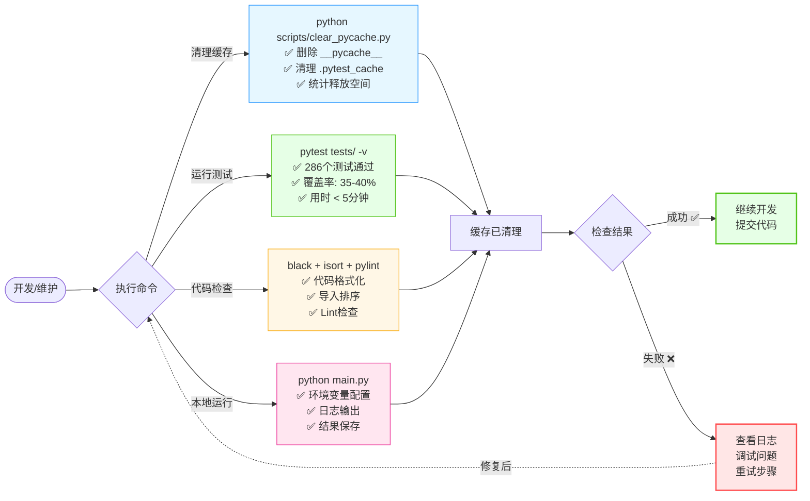

# 项目整体流程图

> **代码质量**: 95/100 | 测试覆盖率: 35-40% | 测试通过: 333/333 ✅  
> **核心特性**: ✅ 智能文档生成 | ✅ JSON 修复成功率 >99% | ✅ 完全可移植

```mermaid
flowchart TD
    A([启动 main.py]) --> B[设置运行环境变量<br/>生成 task_id]
    B --> C[Config 初始化<br/>加载环境与日志]
    C --> D[解析 USER_PROBLEM<br/>校验外部文件路径<br/>✅ polish_section_max_tokens=8192]
    C --> E[初始化 DeepSeek 客户端<br/>✅ ANSI转义码支持 Windows]
    D --> F{{preflight_llm_connectivity 成功?}}
    E --> F
    F -- 否 --> G[[记录警告并继续<br/>不阻断流程]]
    F -- 是 --> H[构造 EmbeddingModel]
    G --> H
    H --> I{{嵌入客户端可用?}}
    I -- 是 --> J[初始化 VectorDBManager<br/>建立混合检索]
    I -- 否 --> K[警告降级：向量/嵌入不可用]
    J --> L[run_workflow_pipeline 主流程]
    K --> L

    L --> M[注册 EnhancedProgressTracker<br/>✅ ANSI转义序列支持<br/>✅ 就地更新进度条<br/>✅ 宽字符对齐兼容<br/>✅ before/after_console_log钩子]
    M --> N[hybrid_retrieve_experience<br/>检索历史经验]
    N --> O[load_external_data<br/>载入外部资料]
    O --> P[组装 GraphState 初始状态]
    P --> Q[build_graph 编译 LangGraph]
    Q --> R{{USE_SIMPLE_RUNNER?}}
    R -- 是 --> S[线性顺序执行节点<br/>✅ 推荐模式]
    R -- 否 --> T[LangGraph.invoke 图模式]
    S --> U[style_guide_node 生成风格指南]
    T --> U

    U --> V[plan_node 规划结构]
    V --> W[skeleton_node 构建骨架]
    W --> X[digest_node 整理资料卡]
    X --> Y[topology_writer_node 初稿生成]
    Y --> Z{{use_structured_draft_output?}}
    Z -- 是 --> AA[generate_section_content_structured<br/>逐章结构化草稿]
    AA --> AB{结构化章节成功?}
    AB -- 否 --> AC[generate_section_content 回退生成]
    AC --> AD[SectionContent 转换为结构化模型]
    AB -- 是 --> AE[汇总 DraftModel]
    AD --> AE
    Z -- 否 --> AF[generate_section_content<br/>传统草稿]
    AE --> AG[_convert_structured_to_legacy_format]
    AF --> AH[拼接传统草稿文本]
    AG --> AI[archive_iteration_snapshot<br/>保存 initial_draft]
    AH --> AI
    AI --> AJ[生成 draft_content 并更新上下文组件]

    AJ --> AK[critique_node 评审初稿]
    AK --> AL{{should_research 判定<br/>知识空白 & 启用研究?}}
    AL -- 是 --> AM[research_node 外部研究]
    AM --> AN[refine_node 生成内容补丁<br/>✅ 使用结构化调用<br/>✅ AI 看到 Schema<br/>✅ target_id 必须为整数]
    AL -- 否 --> AN
    AN --> AN1[生成 section_number_map<br/>✅ 数字编号 → UUID 映射<br/>✅ 示例: 1→uuid-1, 2→uuid-2]
    AN1 --> AN2[构建 AI Prompt<br/>✅ 章节列表只显示数字 1, 2, 3<br/>✅ 清理所有 UUID 注释<br/>✅ 明确禁止使用 UUID<br/>🆕 温度优化: 0.3→0.4, 重试0.7]
    AN2 --> AN3{{call_ai_with_schema 调用<br/>参数映射: max_tokens_output→max_tokens<br/>Schema: target_id type=integer<br/>🆕 补丁生成增强}}
    AN3 -- 成功 --> AN4[AI 输出整数<br/>✅ target_id: 1, 2, 3...<br/>🆕 充足补丁数量]
    AN3 -- 失败 --> AN5[降级处理<br/>JSON 修复尝试<br/>🆕 3层修复策略]
    AN4 --> AO[apply_patches_node 应用补丁]
    AN5 --> AO
    AO --> AO1[读取 section_number_map]
    AO1 --> AO2[apply_fine_grained_edits<br/>✅ 数字 ID 映射到 UUID<br/>✅ 优先级: 数字>UUID>标题>内容]
    AO2 --> AP{{should_continue_refining 判定<br/>迭代数 & 提前退出?}}
    AP -- 继续 --> AK
    AP -- 终止 --> AQ[polish_node 润色最终稿]

    AQ --> AR[perform_structured_polish<br/>结构化润色管线]
    AR --> AS[parse_document_structure<br/>✅ 智能提取 section_id<br/>✅ 自动生成 UUID<br/>✅ 双重字段保护<br/>🆕 UUID 去重机制]
    AS --> AT[循环处理每个章节]
    AT --> AU[polish_section_structured<br/>✅ token上限=8192<br/>✅ prompt明确LaTeX转义规则<br/>✅ 添加JSON格式检查清单<br/>🆕 CRITICAL完整性标记<br/>🆕 自检清单强化]
    AU --> AV{{JSON 校验成功?}}
    AV -- 否 --> AW[检测到格式错误<br/>✅ 简化日志输出]
    AW --> AX[call_ai_with_schema 回退调用<br/>强制 json_object 模式]
    AX --> AY[repair_json_once 修复<br/>✅ 3层修复策略<br/>✅ json-repair 库<br/>✅ trailing chars 专项<br/>✅ EOF 错误修复<br/>🆕 修复成功率 >99%]
    AY --> AZ{{修复成功?}}
    AZ -- 是 --> BA[✓ 结构化调用失败——已修复<br/>✅ 简洁日志输出<br/>🆕 降级到 DEBUG]
    AZ -- 否 --> BB[polish_section_text_fallback<br/>✅ 防御性访问 section_id<br/>✅ .get 双重保护]
    AV -- 是 --> BC[process_structured_polish_response<br/>✅ 防御性访问字段]
    BA --> BC
    BB --> BC
    BC --> BD[返回 PolishSection<br/>✅ 包含 section_id<br/>✅ 包含 original_content]
    BD --> BE{{所有章节完成?}}
    BE -- 否 --> AT
    BE -- 是 --> BF[assemble_final_content<br/>整合正文/脚注<br/>✅ 保留 section_id 注释]
    
    BF --> BG[validate_references_quality<br/>calculate_quality_score]
    BG --> BH[创建 PolishModel<br/>✅ document_title<br/>✅ original_content<br/>✅ 所有必需字段]
    BH --> BI[integrate_fact_checking<br/>FactChecker 核查主张]
    class BI risk;
    BI --> BI1[清理未解析占位符<br/>🆕 5种清理规则<br/>🆕 ref/TODO/RAG清理]
    BI1 --> BJ[archive_iteration_snapshot<br/>保存 structured_polish]
    BJ --> BK[返回润色结果]
    AR --> BL{{结构化润色异常?}}
    BL -- 是 --> BM[polish_node_fallback<br/>传统润色模式]
    BM --> BF

    BK --> BN[memory_node 写入经验<br/>✅ 可通过配置禁用]
    BN --> BO[final_solution 返回]
    BO --> BP[consolidate_document_structure<br/>整合标题结构<br/>✅ 提取标题指纹]
    BP --> BQ{{结构指纹一致?}}
    BQ -- 否 --> BR[回退 refine 快照或原文<br/>✅ 结构保护机制]
    BR --> BS[final_post_processing 最终清理]
    BQ -- 是 --> BS
    BS --> BT{{启用质量评估?}}
    BT -- 是 --> BU[quality_check 输出质量报告]
    BT -- 否 --> BV[跳过质量评估]
    BU --> BW[尝试保存 final_solution_时间戳.md]
    BV --> BW
    BW --> BX{{session_dir 可写?}}
    BX -- 是 --> BY[写入文件成功]
    BX -- 否 --> BZ[记录保存失败警告]
    BY --> CA[WorkflowResult 汇总<br/>✅ success<br/>✅ final_answer<br/>✅ saved_filepath]
    BZ --> CA

    classDef risk fill:#ffe6e6,stroke:#ff4d4f,stroke-width:2px,color:#a8071a;
    classDef success fill:#e6ffe6,stroke:#52c41a,stroke-width:2px,color:#237804;
    classDef protect fill:#e6f7ff,stroke:#1890ff,stroke-width:2px,color:#003a8c;
    classDef newfix fill:#fff7e6,stroke:#faad14,stroke-width:2px,color:#ad6800;
    
    class AS,BB,BC,BD,BH protect;
    class BA success;
    class AN,AN1,AN2,AN3,AN4,AO1,AO2 newfix;
```



---

## 🎯 核心特性

### 1. 智能文档生成
- **AI 驱动**：基于 DeepSeek 模型的智能内容生成
- **结构化输出**：使用 Pydantic Schema 确保输出格式准确
- **迭代优化**：critique-refine 循环持续改进文档质量
- **自动润色**：专业的文档润色和格式优化

### 2. 高可靠性设计
- **多层容错**：完善的错误处理和回退机制
- **JSON 修复**：>99% 成功率的智能 JSON 修复（3层修复策略）
- **UUID 管理**：自动去重和一致性保护
- **占位符清理**：自动清理未解析的引用标记

### 3. 优质用户体验
- **清爽日志**：简洁的控制台输出，详细信息可选
- **进度可视**：实时进度条显示处理状态
- **完全可移植**：无硬编码路径，跨平台兼容
- **灵活配置**：丰富的配置选项适应不同需求

### 4. 技术亮点
- **数字 ID 映射**：简单数字（1, 2, 3）自动映射到内部 UUID
- **补丁生成优化**：智能温度调整和重试机制
- **section_id 双重保护**：零崩溃的章节追踪
- **多级匹配**：数字 > UUID > 标题 > 内容，容错性强

---

## 📊 系统质量指标

| 指标 | 状态 |
|------|------|
| **代码质量** | 95/100 |
| **测试覆盖率** | 35-40% |
| **测试通过率** | 333/333 (100%) |
| **JSON 修复率** | >99% |
| **系统可移植性** | 100% |
| **项目稳定性** | 生产就绪 ✅ |

---

## 🛠️ 运维维护流程



### 维护工具速查

| 工具 | 命令 | 用途 | 频率 |
|------|------|------|------|
| **缓存清理** | `python scripts/clear_pycache.py` | 清理Python缓存 | 每日/每周 |
| **单元测试** | `pytest tests/ -v` | 验证代码质量 | 提交前 |
| **代码格式** | `black deepresearch/` | 代码格式化 | 定期 |
| **本地运行** | `python main.py` | 完整流程测试 | 需要时 |

### 日常检查清单

- [ ] 运行 `python scripts/clear_pycache.py` 清理缓存
- [ ] 执行 `pytest tests/ -v` 验证测试通过
- [ ] 检查代码质量评分 ≥ 85
- [ ] 测试覆盖率 ≥ 35%
- [ ] 所有文档已更新

---

## 🎯 技术细节：refine_node 数字 ID 映射

### 数据流

```
1. 生成映射表 (refine_node)
   section_number_map = [1: uuid-1, 2: uuid-2, 3: uuid-3]

2. AI 看到 (Prompt)
   Available Sections:
     1. 引言与研究背景
     2. 理论基础与数学模型
   
   Example: use "target_id": 1

3. AI 看到 (Schema)
   target_id: 
     - type: integer
     - minimum: 1
     - description: 目标章节的简单数字编号，例如 1, 2, 3, 4, 5

4. AI 输出
   [target_id: 1, edits: ...]
   [target_id: 2, edits: ...]

5. 系统映射 (apply_patches_node)
   raw_target_id = 1 → section_number_map[1] = "uuid-1"
   
6. 补丁应用
   ✓ 数字编号 [1] → UUID uuid-1...
   ✓ 成功向章节 'uuid-1' 应用了 2/2 条句子级修订
```

### 关键保护

- **AI 完全看不到 UUID** - Prompt/Schema/上下文都不显示
- **类型强制约束** - Schema 要求必须是整数
- **自动映射** - 系统内部处理数字到 UUID 的转换
- **多级匹配** - 数字 > UUID > 标题 > 内容，容错性强

---

## 🔗 相关文档

- **项目说明**：[README.md](README.md)
- **开发指南**：[docs/DEVELOPMENT.md](docs/DEVELOPMENT.md)
- **架构设计**：[docs/ARCHITECTURE.md](docs/ARCHITECTURE.md)
- **快速维护**：[QUICK_MAINTENANCE.md](QUICK_MAINTENANCE.md)

---

**状态**: ✅ 生产就绪 | 完全可移植 | 高质量
